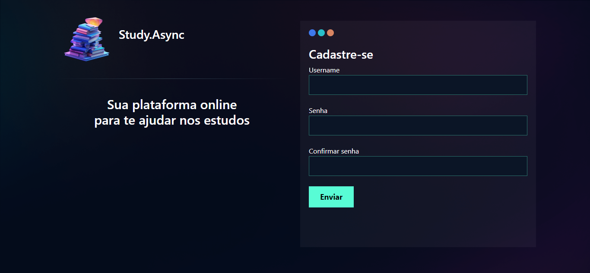
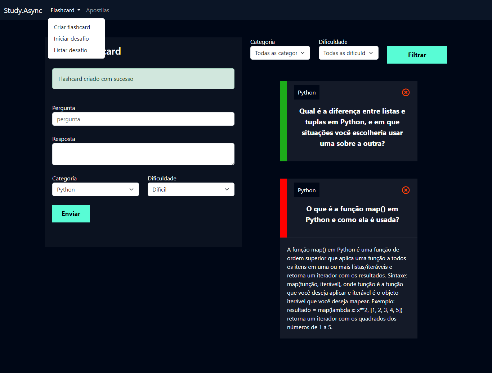

<h1>study.Async</h1>

API Rest para um Sistema de Analise de Solicitação de Crédito

     <a alt="Java">
     
    <a alt="Kotlin">
    
      <a alt="Kotlin">
      

<h3>Descrição do Projeto</h3>

<a href="git@github.com:matheusrodrigues1/study.Async.git">Link</a>

<figure>

   
   
  Diagrama UML Simplificado de uma API para Sistema de Avaliação de Crédito

</figure>
@@ -28,7 +28,6 @@
	<li>Entre na pasta raiz do projeto: <code>cd </code></li> 
	<li>Execute o comando: <code>./gradlew bootrun</code></li>
</ol>

<h3>Autor</h3>